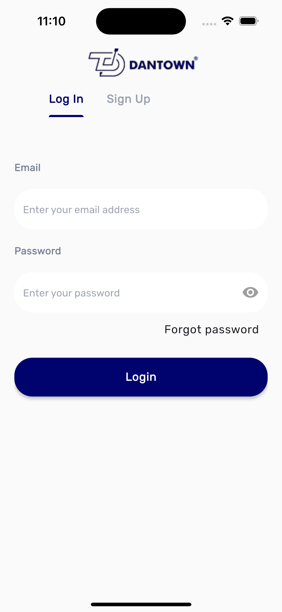
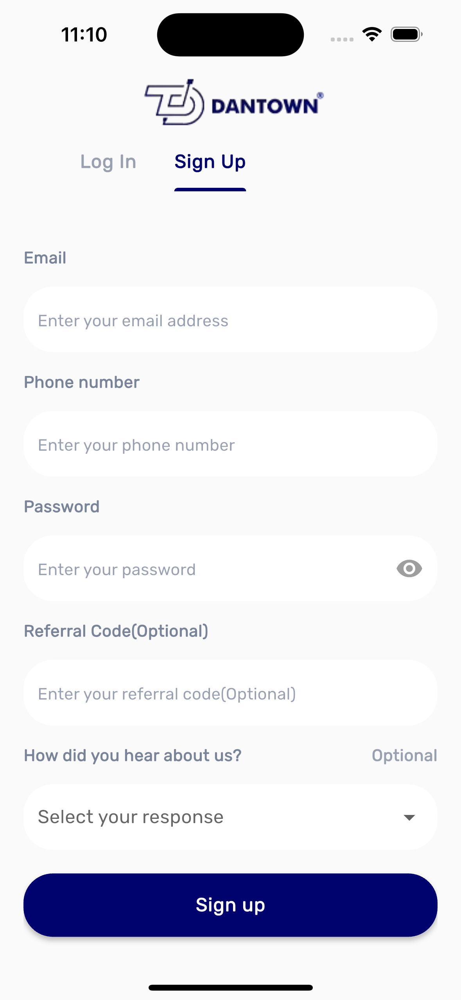
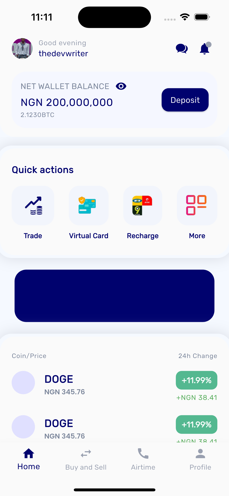
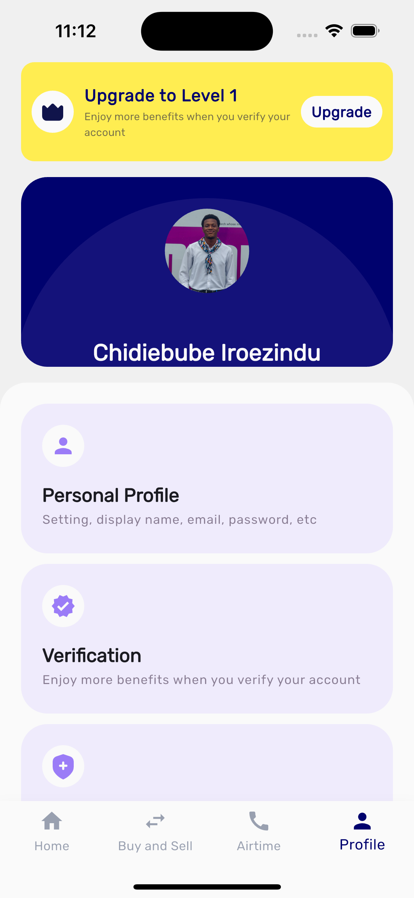

# D-Crypto Lite

A modern Flutter clone of the popular Dantown app, built to showcase my skills in Flutter development, UI/UX, and app architecture.

---

## 🌟 Features

-   Clean, modern UI inspired by Dantown
-   Wallet dashboard with balances and growth stats
-   Buy/Sell crypto interface
-   Airtime top-up page
-   Transaction history
-   User profile management
-   Mocked authentication flow
-   State management with Provider
-   Modular, scalable folder structure

---

## 🚀 Getting Started

### Prerequisites

-   Flutter SDK (3.32 recommended)
-   Dart SDK (3.8 recommended)
-   Your preferred IDE (VS Code, Android Studio, etc.)

### Installation

1. **Clone the repository:**

    ```bash
    git clone git@github.com:thedevsaxist/dantown-clone.git
    cd dantown-clone
    ```

2. **Install dependencies:**

    ```bash
    flutter pub get
    ```

3. **Set up environment variables:**

    Create a `.env` file in the project root and add your own email and password:
    ```env
    EMAIL="your_email@example.com"
    PASSWORD="your_secure_password"
    ```


4. **Run the app:**
    ```bash
    flutter run
    ```

---

## 🏗️ Project Structure

```
lib/
├── app/
│   ├── core/
│   │   ├── constants.dart            # App-wide constants
│   │   ├── gen/                      # Generated assets (images, etc.)
│   │   ├── routes/                   # App routing and navigation
│   │   ├── service_locators.dart     # Dependency injection setup
│   │   ├── theme.dart                # App theme and colors
│   │   ├── utils/                    # Helper functions and utilities
│   │   └── widgets/                  # Shared widgets (e.g., wallet_display.dart, coins_tile.dart)
│   └── features/
│       ├── trade/                        # Example feature: Trade (Buy/Sell crypto)
│       │   ├── data/                     # Data sources, models, repositories
│       │   │   ├── models/               # Data models (e.g., Trade, Coin)
│       │   │   ├── datasources/          # Remote/local data providers
│       │   │   └── repositories/         # Repository implementations
│       │   ├── domain/                   # Business logic, entities, use cases
│       │   │   ├── entities/             # Core business entities
│       │   │   ├── repositories/         # Repository interfaces (abstract)
│       │   │   └── usecases/             # Application-specific use cases
│       │   └── presentation/             # UI layer
│       │       ├── state/                # State management (providers, notifiers)
│       │       └── screens/              # Feature screens (e.g., buy_sell_screen.dart)
│       └── ...other features             # (e.g., auth, home, profile, airtime_and_data)
├── dantown_clone.dart                    # Main app widget
├── main.dart                             # App entry point
```

---

## 📄 Assets

```
assets/
├── images/
│   ├── exchange.png
│   ├── virtual_card.png
│   └── ...other icons
└── logos/
    ├── dantown_logo.png
    └── ...font files
```

---

## 📚 Tech Stack

-   **State Management:** Provider
-   **UI:** Material Design, custom widgets
-   **Mock Data:** Local JSON
-   **Architecture:** Modular, feature-first

---

## 🛠️ Development

### Adding New Features

1. Create a new feature directory under `lib/features/`
2. Implement your screens, models, and providers
3. Add tests and update documentation as needed

---

## 📱 Building for Production

To build the release version:

```bash
# Android
flutter build apk

# iOS
flutter build ios
```

---

## 📸 Screenshots










---

## 🤔 Why This Project?

This project was built as a personal exercise to demonstrate my ability to think like a product engineer, not just a Flutter coder. It reflects core concepts like:

-   Reusable widgets
-   Data-driven UIs
-   Thoughtful UX for mobile fintech apps
-   Clean, maintainable code

---

## 📄 License

MIT – feel free to fork and build your own features!

---

## 👤 Author

-   [Chidiebube Iroezindu](mailto:your.chidiebubeiroezindu@gmail.com)
